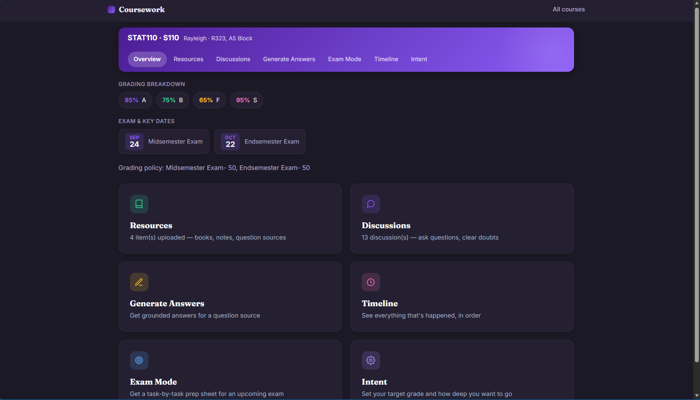
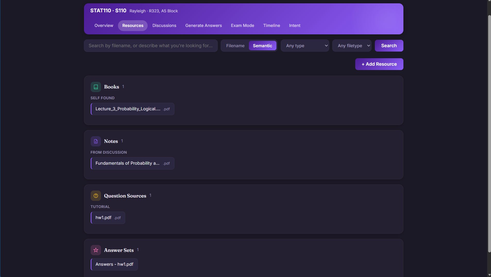
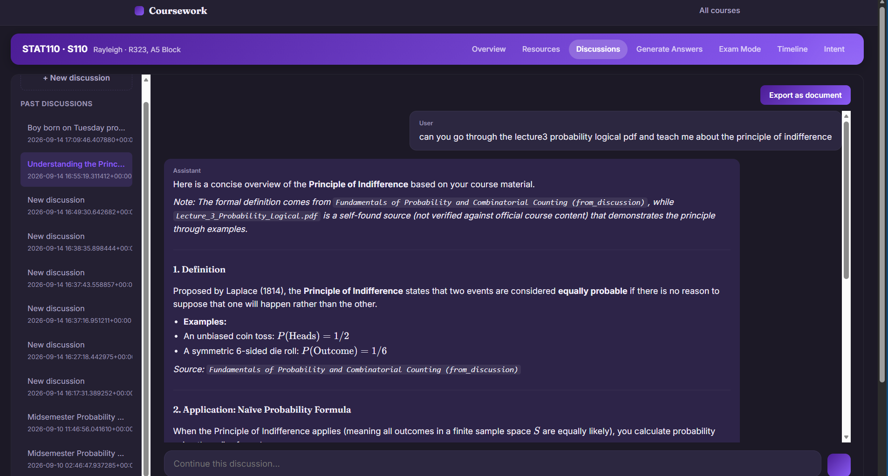
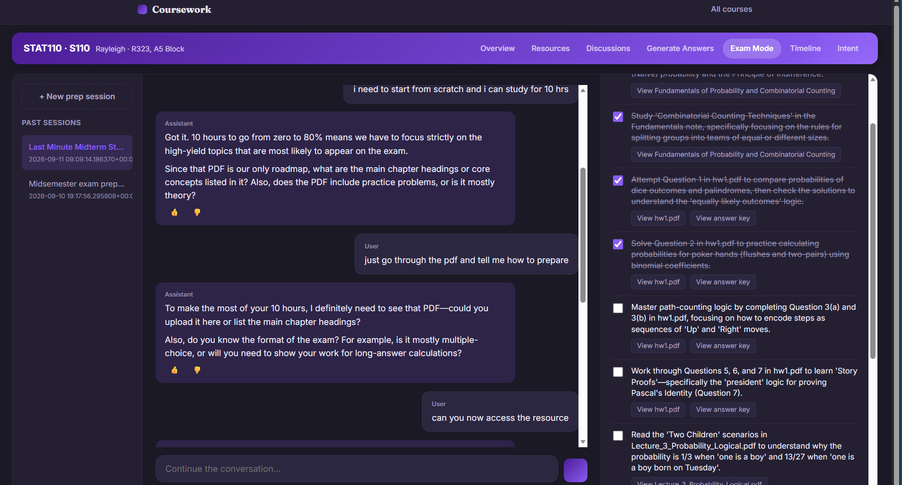
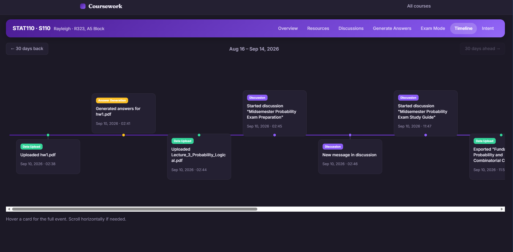
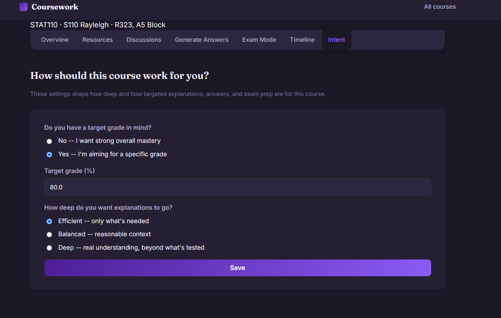

# Coursework — an AI study assistant grounded in your own course material

Coursework organizes everything for one course — books, notes, question sources, past exams — into a searchable knowledge base, and grounds every AI feature (chat, exam prep, answer generation) in that material specifically, down to the page it came from.

It's built as a self-hosted, single-user web app: FastAPI backend, Postgres + pgvector for storage and retrieval, and Google's Gemini API for generation — all on free tiers.

---

## Why this exists

Generic "chat with your PDF" tools treat every upload the same way and forget everything about your course between sessions. Coursework instead:

- Organizes resources by **type and provenance** (book vs. note vs. question source vs. answer set; professor-provided vs. self-found vs. self-written)
- Grounds answers with **real page citations**, not guesses
- Understands your **grading weightage and target grade**, and adjusts how deep explanations go accordingly
- Builds an actual **task-based exam prep checklist** from your material, not generic study advice

## Features

**Resources**
- Upload PDFs (with OCR fallback for scanned pages), DOCX, TXT, and MD — single or multi-file, drag-and-drop supported
- Per-page chunking and embedding, so citations reference real page numbers, not guesses
- Automatic topic tagging on every resource
- Hybrid search: fuzzy filename matching (typo-tolerant), semantic search, keyword search, and topic-match search, all fused together — with type/filetype filters
- Edit metadata, download, or delete any resource

**Discussions**
- ChatGPT-style chat grounded in your course material, with page-cited sources
- Auto-generated discussion titles based on content
- Export any discussion as a clean, structured PDF (doubts clarified / concepts taught / study plan — auto-detected, your choice to combine or split)

**Generate Answers**
- Pick a question source, get grounded answers generated against your other material
- Iteratively refine via chat ("add more detail to Q3") with a live PDF preview, before saving a final version to your Resources

**Exam Mode**
- A conversational intake to understand your time constraints and weak spots
- Generates an ordered, checkable prep sheet — specific tasks referencing real pages and real question sources, not generic advice
- Auto-generates missing answer keys for referenced tutorials, only when you ask
- "Update prep sheet" re-reads the conversation and applies discussed changes on your command

**Intent**
- Set a target grade (or none, for open-ended mastery) and a depth preference (efficient / balanced / deep)
- Shapes tone and depth across chat, answer generation, and exam prep

**Timeline**
- Color-coded, 30-day-windowed activity history across the whole course

## How the RAG pipeline works

1. **Ingestion**: uploaded files are extracted (with OCR fallback), chunked at paragraph/sentence boundaries (not raw word counts), embedded, and stored per-page.
2. **Retrieval**: a query gets embedded and matched by cosine similarity against stored chunks, merged with literal keyword search (Postgres full-text) and topic-tag matches — so both fuzzy conceptual matches and exact rare terms get found.
3. **Re-ranking**: a broad candidate pool gets narrowed to the most relevant few by a cheap secondary model pass before generation.
4. **Generation**: the final prompt includes the retrieved, cited material, plus course context (weightage, target grade, depth preference) — sent to Gemini, which every call in the app routes through a single retry-on-overload wrapper.

## Tech stack

| Layer | Choice |
|---|---|
| Backend | Python, FastAPI |
| Database | Postgres (Supabase) with `pgvector` and `pg_trgm` |
| Embeddings | `sentence-transformers` (`all-MiniLM-L6-v2`), local, free |
| Generation | Google Gemini API (model configurable via `.env`) |
| PDF generation | `markdown` + `xhtml2pdf` |
| Frontend | Server-rendered Jinja2 templates, vanilla JS, KaTeX for math rendering |

## Getting started

See [`SETUP.md`](./SETUP.md) for full step-by-step setup (Supabase project, Gemini API key, Tesseract OCR, Python environment).

Quick version:
```bash
python3 -m venv venv
source venv/bin/activate       # Windows: venv\Scripts\activate
pip install -r requirements.txt
cp .env.example .env           # fill in DATABASE_URL and GEMINI_API_KEY
# run schema.sql (fresh install) or the migration_vN.sql files in order (existing DB) in the Supabase SQL editor
uvicorn main:app --reload
```

Then open `http://localhost:8000`.

## Project structure

```
main.py              FastAPI routes
rag.py                All Gemini calls, retrieval, and generation logic
ingestion.py          File extraction, OCR, chunking, embedding
pdf_export.py         Markdown -> styled PDF rendering
db.py                 Database connection helper
templates/            Jinja2 templates
static/style.css      Full stylesheet
schema.sql             Fresh-install database schema
migration_v2.sql .. v8.sql   Incremental migrations for existing installs
test_gemini.py         Standalone script to test Gemini API connectivity independent of the app
```

## Known limitations

- **Single-user, local-only** — no auth or multi-user support yet; runs on `localhost`.
- **Free-tier quota limits apply** — Gemini's free tier caps requests per day per model; heavy use can hit this.
- **PDF exports don't render LaTeX** — math renders properly in chat (via KaTeX) but shows as raw text in generated PDFs.
- **Topic tags are assigned at creation time only** — resources uploaded before a given feature was added won't have tags until re-uploaded.








